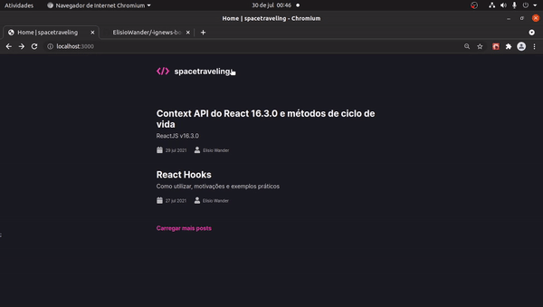

<h1 align="center">
    
</h1>


<h1 align="center">
    
</h1>

## 🏷️ Sobre 
**SpaceTraveling** é um blog feito para cumprir o terceiro desafio do Bootcamp Ignite da Rocketseat.

---

## 🛠️ Tecnologias utilizadas
Foram utilizadas as seguintes tecnologias para desenvolver a aplicação **SpaceTraveling** :

- [Next](https://nextjs.org/)
- [Typescript](https://www.typescriptlang.org/)
- [Sass/CSS-Module](https://sass-lang.com/)
- [Prismic](https://prismic.io/)

---

## 🗂️ Como baixar e iniciar o projeto 

```bash

    #clonar o projeto
    $ git clone https://github.com/ElisioWander/ignite-blog-challenge-03.git

    #entrar no diretório
    $ cd ignite-blog-challeng-03

    #instalar as dependências
    $ yarn

    #iniciar a aplicação
    $ yarn dev
```
### Servidor local
localhost:3000

---

## Autor
### 👤 Elisio Wander

- Linkedin: [@elisioWander](https://www.linkedin.com/in/elisio-wander-b88b69136/)
- github: [@elisioWander](https://github.com/ElisioWander)

---
## 📝 Licença
Copyright © 2020 [@ElisioWander](https://github.com/ElisioWander/-ignews-bootcamp-ignite-rocketseat/blob/master/LICENSE)

Este projeto está sobe a [LICENÇA MIT](https://opensource.org/licenses/MIT)

---

### Desenvolvido 💜 by Elisio Wander
